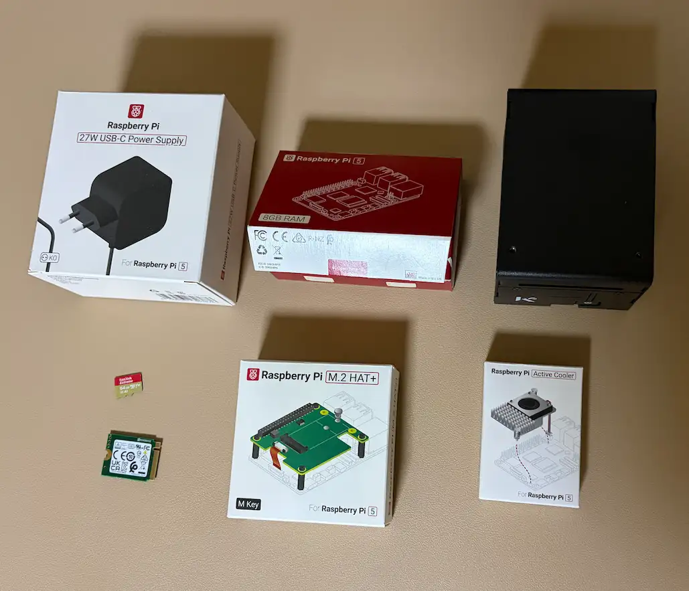
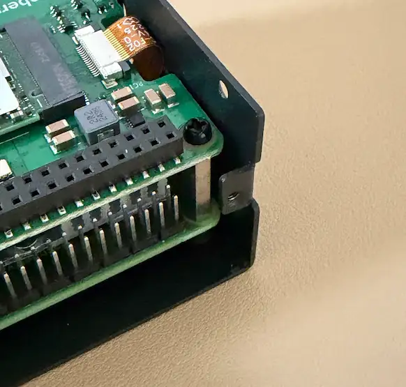
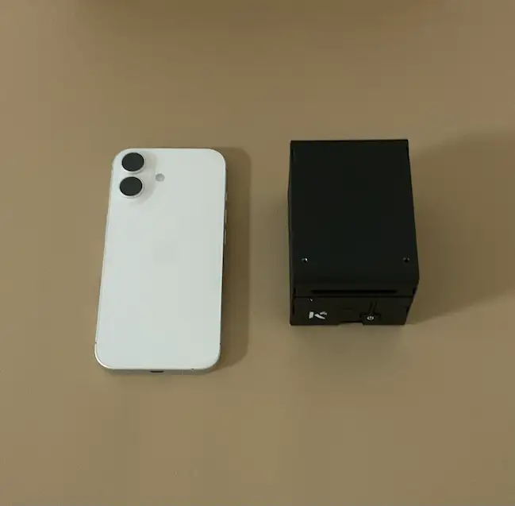

### 사용한 제품들

하드웨어 조립이나 세팅은 유튜브나 저보다 자세하게 다루는 분들이 많다 보니 간단하게만 하고 넘어가려고 합니다.

### 케이스 조립 참고사항

KKSB 케이스에 파이를 장착하려니 M2(흔히 메인보드 스탠드오프)규격의 나사를 사용하는데 사진처럼 공간이
잘 안나와서 M2드라이버 하나쯤 마련해 둬야 조립이 편할 것 같습니다.

### 조립 완료 및 크기 비교

아이폰17 일반이랑 비교해도 높이는 어쩔 수 없지만 크기는 상당히 작았습니다.

### 초기 부팅 및 세팅
글 작성 시점에선 이미 헤르메스, 우마미까지 세팅 되어 있는 상태라 초기 세팅 사진이 없어 글로 적당히 대체했습니다.

파이OS Lite를 사용하고, 여분 모니터도 없어 맥북에서 SSH로 접속하고 진행했습니다. SSH접속은 간단하게 공유기 페이지 확인해서 파이에 할당된 IP확인하고 터미널에서 `SSH 파이유저명@파이IP` 입력 후 비번입력하면 됩니다.

1. `lsblk`로 SD카드 부팅 확인 -> `rpi-clone`으로 SSD로 복제
2. `sudo raspi-config` -> 어드밴스드 -> 기본 부팅 SSD로 변경

SSD로 부팅 변경 후 저장, SD카드를 제거하고 `sudo reboot`를 실행하니 명령어가 안먹었습니다. OS가 메모리에서 돌아갈것 같아 뽑아도 되는줄 알았는데 안되서 전원버튼으로 껐다 켰으니, 리부트 말고 셧다운 후 SD카드 제거하는게 좀 더 안전합니다.

이후 SSD로 부팅된거 확인하고 소프트웨어 작업 이어갔습니다.
