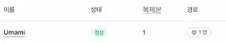

### SSH 키 생성
터미널에서 매번 비밀번호 입력해서 접속하긴 귀찮으니 맥북에서 ssh키를 생성해서 ssh 명령어만 입력하면 바로 로그인되게끔 설정했습니다.

```zsh
ssh-keygen -t ed25519 -C "raspberrypi"
ssh-copy-id 사용자명@라즈베리파이IP

# 접속 후 파이 업데이트
sudo apt update && sudo apt upgrade -y
```
<br>

---

### 도커 설치
우마미를 도커 compose로 설정하고, 헤르메스 터미널도 도커로 돌릴꺼라서 도커부터 설치해주었습니다.

```bash
# Docker 설치 스크립트 다운로드 및 실행
curl -sSL https://get.docker.com | sh

# 현재 사용자를 docker 그룹에 추가
sudo usermod -aG docker $USER

# SSH 세션 종료 후 재접속
exit
ssh 사용자명@라즈베리파이IP

# 그룹에 추가되었는지 확인
groups

# 도커 테스트
docker --version
docker run hello-world
```
마지막으로 `Hello from Docker!`가 출력되고 기본 세팅은 완료되었습니다.

---

### 우마미 세팅, 실행
우마미는 클라우드플레어 터널로 설정하여 해당 서비스 기준으로 설명합니다.  
클라우드플레어, 우마미 사용법은 다루지 않아서 자세하게 다루는 문서를 참고하는걸 추천드립니다.

```bash
# 작업 폴더 생성, 이동
mkdir -p ~/umami && cd ~/umami

# 앱시크릿 랜덤 생성 명령어(.env사용)
openssl rand -base64 32

# env생성 및 설정
nano .env
# 아래 내용 입력
APP_SECRET=랜덤한_긴_문자열
POSTGRES_PASSWORD=랜덤한_비밀번호
# 지금 시점에선 비워둠, 어드민 삭제 후 입력
CLOUDFLARE_TUNNEL_TOKEN=클라우드플레어_터널_토큰값

# docker-compose.yml 작성
nano docker-compose.yml
# 아래 내용 입력
services:
  umami:
    image: umamisoftware/umami:3.1.0 # 버전 고정용
    ports:
      - "127.0.0.1:3000:3000" # 로컬 호스트만 열게끔
    env_file:
      - .env
    depends_on:
      - db

  db:
    image: postgres:15-alpine
    environment:
      POSTGRES_DB: umami
      POSTGRES_USER: umami
      POSTGRES_PASSWORD: ${POSTGRES_PASSWORD}
    volumes:
      - umami-db-data:/var/lib/postgresql/data

  cloudflared:
    image: cloudflare/cloudflared:latest
    command: tunnel run
    env_file:
      - .env
    environment:
      - TUNNEL_TOKEN=${CLOUDFLARE_TUNNEL_TOKEN}
    depends_on:
      - umami

volumes:
  umami-db-data:

# 실행 및 로그 확인
docker compose up -d
docker compose logs -f
```

여기까지 잘 실행되었다면 클라우드플레어 터널 접속은 안되고, 로컬에서는 우마미 접속이 되는 상태입니다.

env에 터널 토큰값을 비워둔 이유는 우마미 기본 어드민 계정 삭제 후 터널 오픈할거라 비워두었습니다.  
로컬에서 우마미 접속 후 새 관리자 생성 -> 기본 어드민 삭제 후 터널 토큰값 입력하시면 됩니다.

```bash
# 터널 토큰값 입력후 도커 재시작
nano docker-compose.yml
docker compose restart
```



클라우드 플레어 터널까지 활성화 되었으면 모니터링할 사이트 연결 진행하시면 됩니다.

---

### 클라우드플레어 터널을 사용한 이유
이 사이트 도메인도 클라우드플레어 통해서 구매한거고, 공유기 포트포워딩보단 외부 접근을 전체 차단하고 터널로 아웃바운드 통해서 특정 서비스만 오픈해 보려고 해서 터널을 사용해 봤습니다.

터널 대신 포트포워딩으로 직접 열어주는 방법도 있습니다. 다만 터널(혹은 다른 서비스)이든 포트포워딩이든 둘 중 하나는 설정해야 외부에서 데이터가 수신되어 집계가 됩니다.
