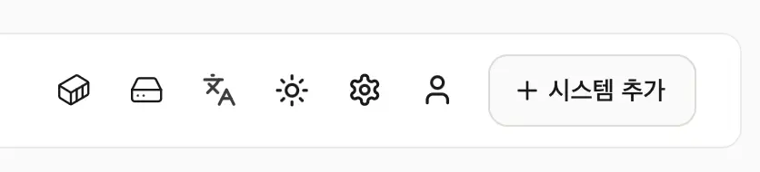
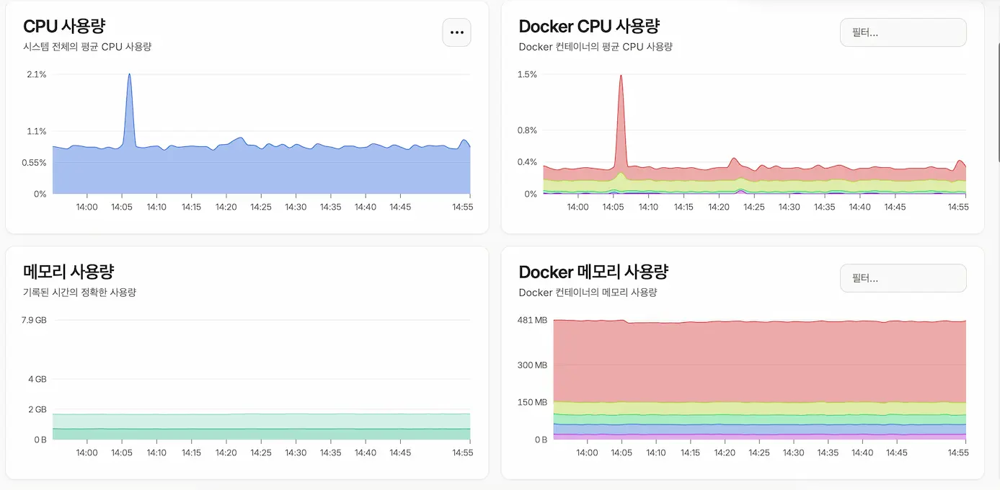

### Beszel은 무엇인가?
간단하게 말하면 CPU, RAM, 온도, 디스크 상태, 도커 컨테이너 상태 등의 정보를 웹에서 보기 편하게 기록해주는 도구입니다. 실시간 모니터링에는 적합하지 않아서 기록을 남겨두고 부하가 얼마나 걸리는지, 평균 얼마나 쓰는지 모니터링하는 데 사용합니다.

### 설치
Beszel은 허브(웹 UI), 에이전트(데이터 수집) 두 개의 도커 컨테이너로 돌아가고 있고 둘 다 파이에 설치해서 모니터링합니다. 추가로 `smartmontools`를 설치해서 SSD 모니터링까지 설정했습니다.

```bash
# 작업 폴더 생성, 이동
mkdir -p ~/beszel && cd ~/beszel

# smartmontools 설치 - 디스크 모니터링용
sudo apt install smartmontools

# NVMe 디바이스 이름 확인 (compose에 넣을 이름 미리 확인)
sudo smartctl --scan
# 여기서 나온 이름이 /dev/nvme0이 아니면 아래 devices 값을 그 이름으로 맞춰야 함

# docker-compose.yml 작성
nano docker-compose.yml

# 아래 내용 입력
services:
  beszel:
    image: henrygd/beszel:0.18.7 # 허브, 버전 고정용
    container_name: beszel
    restart: always
    ports:
      - "127.0.0.1:8090:8090" # 로컬호스트만 열게끔
    volumes:
      - beszel_data:/beszel_data

  beszel-agent:
    image: henrygd/beszel-agent:0.18.7-alpine # 버전 고정
    container_name: beszel-agent
    restart: always
    network_mode: host # 호스트 리소스 직접 봐야 해서 host 네트워크로
    devices:
      - /dev/nvme0:/dev/nvme0 # 파티션(nvme0n1)이 아니라 컨트롤러 이름
    cap_add:
      - SYS_RAWIO
      - SYS_ADMIN
    environment:
      LISTEN: 45876
      KEY: "허브에서_발급받은_공개키" # 웹 UI 실행 후 나중에 입력
      TOKEN: "허브에서_발급받은_토큰" # 웹 UI 실행 후 나중에 입력

volumes:
  beszel_data:

# 허브만 먼저 실행 (KEY/TOKEN 없이 에이전트까지 같이 올리면 재시작 루프에 빠짐)
docker compose up -d beszel
```

폴더 생성, compose까지 만들고 먼저 웹 UI를 열어서 계정을 생성하고 로그인하면 시스템 추가라는 메뉴가 있습니다.

- 이름 : 마음대로
- 호스트 / IP : 모니터링할 기기(파이) IP 입력, **localhost** 쓰면 모니터링 안됨
- 포트 : 기본값 사용
- 공개키, 토큰 : 복사해서 다른 곳에 잠깐 저장

여기까지 진행하고 compose 파일에 복사해둔 공개키, 토큰을 입력해 주시면 됩니다. 이후 `docker compose up -d` 사용해서 에이전트까지 실행하면 모니터링이 시작됩니다.

### ufw 방화벽 오픈 - 방화벽을 설정한 경우에만
제 경우 파이에서 ufw 설정으로 대부분 포트를 차단해둔 상태라 `docker compose up -d` 이후에 모니터링이 안되는 문제가 있었습니다. 허브(웹 UI)는 도커 네트워크에서, 에이전트(데이터 수집)는 파이 호스트에서 실행되고 있어 방화벽에서 차단되고 있었습니다.

간단하게 도커 브릿지 네트워크만 방화벽에 추가로 오픈해서 해결했습니다.

```bash
# 방화벽에서 차단되고 있는지 로그 확인
sudo journalctl -k --since "6 hours ago" | grep -oP 'DPT=\K[0-9]+' | sort | uniq -c | sort -rn | head

# 브릿지 서브넷 확인
docker network inspect beszel_default --format '{{range .IPAM.Config}}{{.Subnet}}{{end}}'

# 도커 브릿지 대역에서 45876으로 오는 요청만 허용
# 주소는 확인된 걸로 갈아끼우시면 됩니다
sudo ufw allow from 172.16.0.0/12 to any port 45876 proto tcp comment 'beszel hub to agent'

# 적용 확인
sudo ufw status numbered
```



이렇게 모니터링 툴까지 설정이 완료되었습니다. 실시간 모니터링은 아쉽지만 언제 부하가 많이 걸리는지 볼 수 있고, 인터넷이 끊기면 그래프에 공백이 생겨서 인터넷 문제 생기는 경우도 알 수 있어서 나름 괜찮았습니다.
