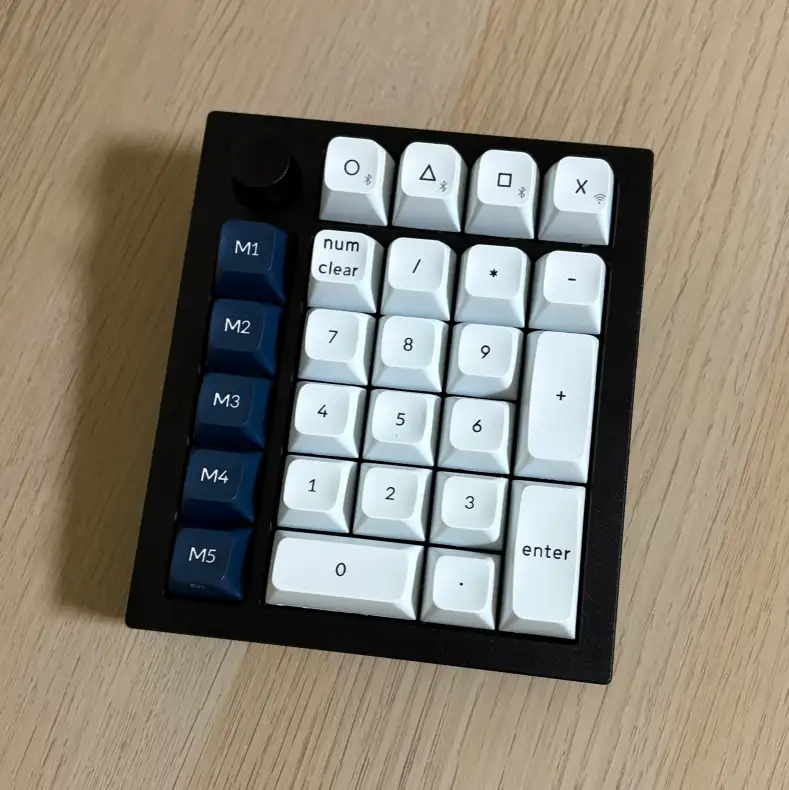

### 한 줄 느낌
제품은 좋은데 가격은 쉽지 않다.

### 제품 정보

정가 : 189,000원

### 장점
- 제품 하드웨어의 전체적인 퀄리티 좋음
- 핫스왑, QMK(VIA)지원, 노브 달림
- 키크론 웹 런처(VIA같은거) UI 디자인 좋음

### 단점
- 가격 진입장벽이 있어 보임
- 자주 쓰는 프로그램 바로 실행 등록하려면 웹 런처 + 별도 프로그램 까지 설치해야 함(백그라운드 실행)

### 전체적인 사용 평
사파리 실행(shift + control + command + s)등으로 실수로 눌리지 않게 설정하고 매크로 등록하면 사용은 잘 됨, 프로그램을 바로 실행 하는 건 스트림덱 쪽이 좋을거  같음, VIA, 키크론 웹 런처는 사파리에서 사용 불가능함.

넘패드로 사용하기보단 매크로패드처럼 사용하려고 자주 쓰는 단축키들 매크로로 만들어서 쓰니 생각보다 괜찮음, 노브는 멋있긴 한데 딱히 사용처가 떠오르진 않았음.

잘 쓰다가 막상 없어지면 아쉬울듯한 제품인데 대체제는 많아 보임, 돈 좀 쓰더라도 퀄리티 좋은 걸 사려면 괜찮은듯함.
