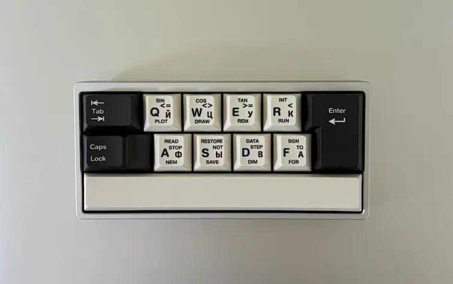

### 한 줄 느낌
바라보기만 해도 좋은 키보드.

### 제품 정보

정가 : 65달러

사용 제품
- 루민키 노바 미니 베어본
- 80Retros x HMX V0 저소음 리니어
- 사전윤활 나이트 스테빌
- 스웨그키 FBB KPOK 키캡

### 간단 리뷰
특이한 배열이다 보니 장단점을 나열하긴 애매할 것 같고, 키보드라기보단 매크로패드를 사용한다 생각하면 나쁘지 않습니다. 제품 사이즈가 거의 아이폰17과 비슷한 수준으로 그냥 책상 위에만 올려 둬도 보는 맛이 있어서 취향만 맞는다면 사볼 만하다고 생각합니다.

아쉬운 점은 전원버튼이 하우징 외부가 아닌 캡스락 아래 기판에 있어, 동봉된 드라이버 등으로 켜고 꺼야 합니다. 설명서 보니 10분, 30분마다 1, 2단계 절전모드에 진입해 사실상 켜두고 사용해야 하는 제품입니다.

핫스왑 기판에 윤활된 스위치, 스테빌까지 사용해서 조립은 간단하게 끼워 맞추면 되는 수준이었고 생각보단 재밌었습니다.
